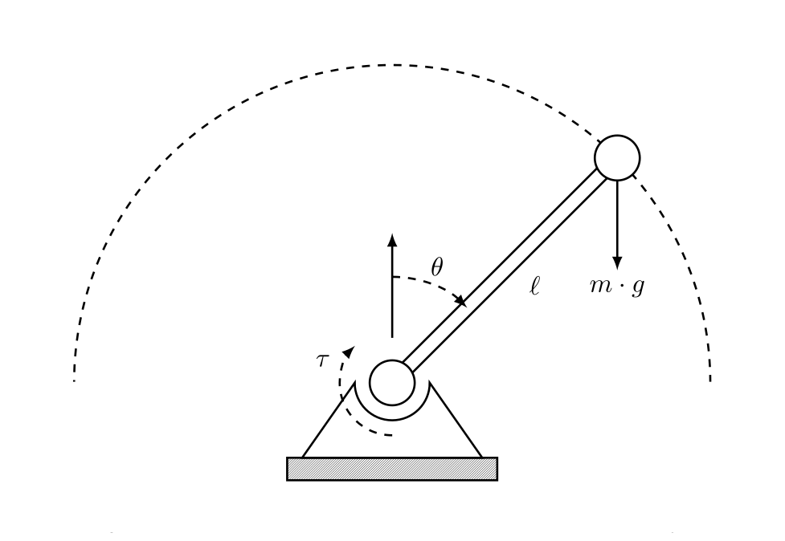
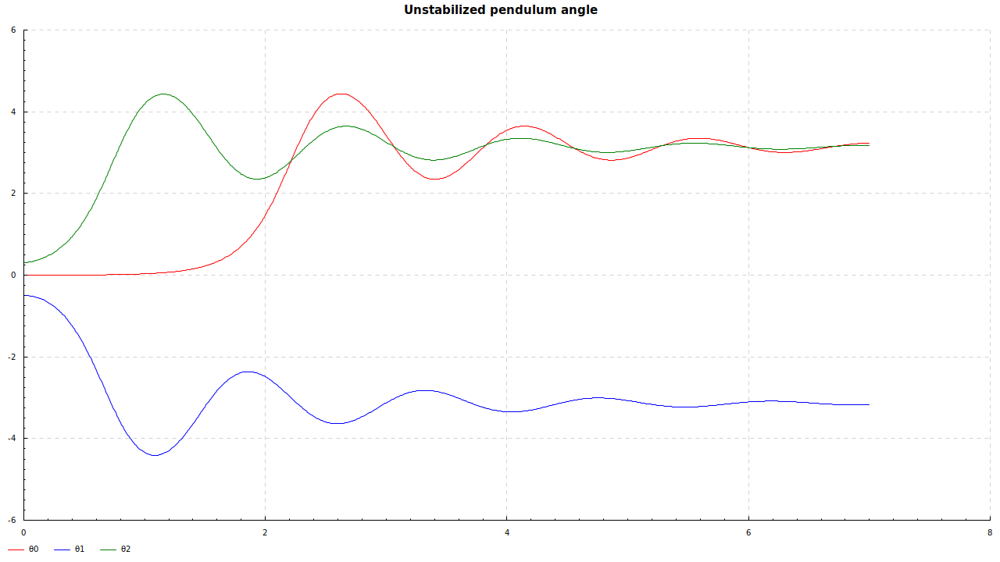
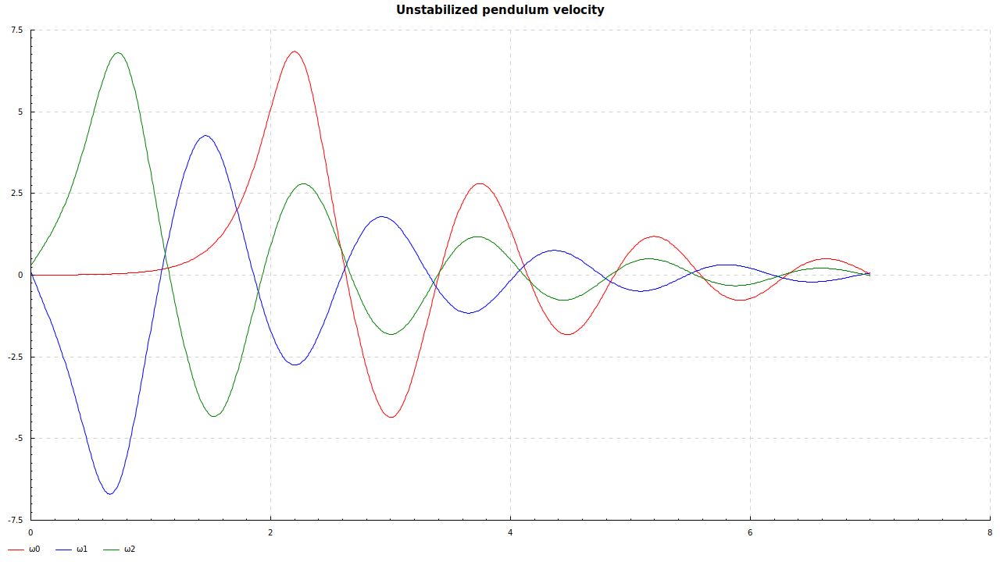
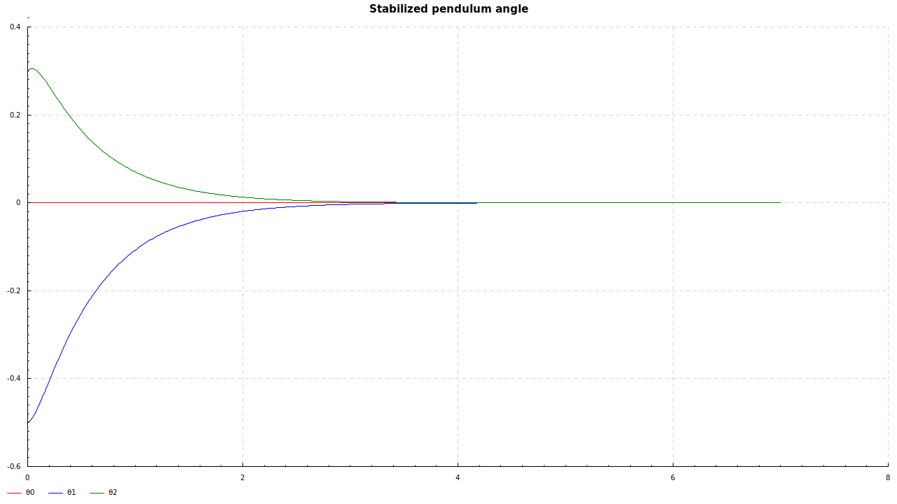
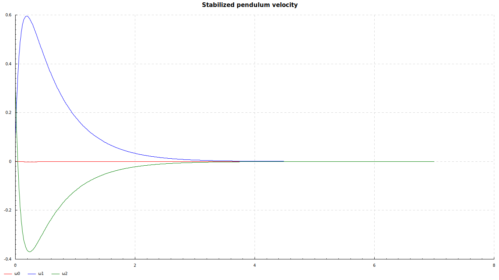
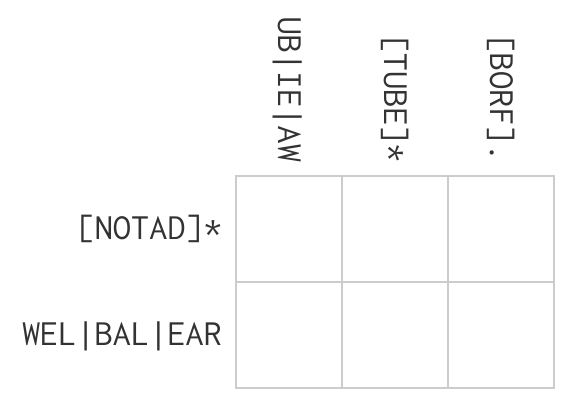

# Overview

<!-- Today's talk touches on a number of topics dear to our hearts as -->
<!-- functional programmers.  In particular, a lot of functional -->
<!-- programmers talk about proving things.  Usually this means either -->
<!-- proving something very simple with Haskell's types or proving -->
<!-- something a lot more complex in a language like Agda or Coq.  I'm -->
<!-- going to talk about a way to automatically prove things of moderate -->
<!-- complexity using tools that are not built into a language, without -->
<!-- writing proofs (only theorems).  A great way to make this happen, for -->
<!-- someone unaccustomed to the external tools, is to do another trick we -->
<!-- as functional programmers talk about a lot, which is to use a -->
<!-- domain-specific language. -->

<!-- I apologize in advance for a few things: I will assume basic knowledge -->
<!-- of Haskell; one of the examples applies some (basic) physics, and I -->
<!-- won't have time to go into detail during the talk; many of the -->
<!-- examples are cribbed from the SBV documentation, partly because it's -->
<!-- so good and partly because it contains a much wider variety of -->
<!-- problems than I've personally used SBV to solve; I don't understand -->
<!-- SAT and SMT well enough to give a really great explanation of the -->
<!-- underlying theory (everything I know about SMT I learned while trying -->
<!-- to do increasingly complex proofs and optimization problems on -->
<!-- floating-point programs). -->

 - What is
   - SAT
   - SMT
   - SBV

 - Proofs
   - Simple proofs
   - Stability proof for a feedback controller

 - Code generation

 - Constraint solving

 - Optimization

# SAT

Boolean **SAT**isfiability

For some formula involving logical variables and logical connectives,
is there an assignment of boolean values to the variables that makes
the formula `true`?

# SAT

Boolean **SAT**isfiability

For some formula involving logical variables and logical connectives,
is there an assignment of boolean values to the variables that makes
the formula `true`?

Example:

   $\Huge \displaystyle{A \land \left(B \lor \left(\neg C \right)\right)}$

# SAT

Boolean **SAT**isfiability

For some formula involving logical variables and logical connectives,
is there an assignment of boolean values to the variables that makes
the formula `true`?

Example:

   $\Huge \displaystyle{A \land \left(B \lor \left(\neg C \right)\right)}$

 - Variables: `A`, `B`, `C` . . .
 - Connectives are always $\Huge \land$ (`AND`), $\Huge \lor$ (`OR`) and $\Huge \neg$ (`NOT`).

<!-- SAT was the first problem to be proved to be NP-complete.  So assuming -->
<!-- $\Huge P \neq NP$, this problem can't be solved in polynomial time -->
<!-- (in the size of the formula).  Sad times! -->

<!-- You can find free and commercial solvers for this problem that are -->
<!-- quite fast for many practical problems.  I haven't used any myself, so -->
<!-- I can't recommend any. -->

# SMT

**S**AT **M**odulo **T**heories

Take a SAT formula and replace some or all of the variables with
predicates over a more complicated theory.  Example:

   $\Huge \left(2*x + y < 0) \land (x \geq 0)$

<!-- The "more complicated theory" in this case is linear arithmetic over -->
<!-- integers (or real numbers?). -->

<!-- Obviously this problem is no easier than SAT, and in many cases it's -->
<!-- much harder.  For many "more complicated theories," you can replace -->
<!-- e.g. a 32-bit integer with 32 boolean variables, addition with the -->
<!-- appropriate full-adder function, and use a SAT solver to solve. -->
<!-- Modern solvers know important axioms about the underlying "more -->
<!-- complicated theories" to do better than this. -->

# SMT

**S**AT **M**odulo **T**heories

Take a SAT formula and replace some or all of the variables with
predicates over a more complicated theory.  Example:

   $\Huge \left(2*x + y < 0) \land (x \geq 0)$

"More complicated theories" include

 - algebraic real numbers
 - floating-point arithmetic
 - integer arithmetic
 - arrays
 - bitvectors
 - "uninterpreted functions"
 - strings (Z3)

# SMTLIB

<!-- Basically this defines a standard way to write out SMT problems
that all solvers can accept.  This lets you quickly change out one
solver for another. -->

[http://smtlib.cs.uiowa.edu/Logics/logics.png](http://smtlib.cs.uiowa.edu/Logics/logics.png)

# SMTLIB

[http://smtlib.cs.uiowa.edu/Logics/logics.png](http://smtlib.cs.uiowa.edu/Logics/logics.png)

Examples:

 - `QF_BV` is "quantifier-free formulae over the theory of fixed-size
   bit-vectors."

# SMTLIB

[http://smtlib.cs.uiowa.edu/Logics/logics.png](http://smtlib.cs.uiowa.edu/Logics/logics.png)

Examples:

 - `QF_BV` is "quantifier-free formulae over the theory of fixed-size
   bit-vectors."

 - `QF_NIA` is "quantifier-free formulae over the theory of nonlinear
   integer arithmetic."

# SMTLIB

[http://smtlib.cs.uiowa.edu/Logics/logics.png](http://smtlib.cs.uiowa.edu/Logics/logics.png)

Examples:

 - `QF_BV` is "quantifier-free formulae over the theory of fixed-size
   bit-vectors."

 - `QF_NIA` is "quantifier-free formulae over the theory of nonlinear
   integer arithmetic."

 - `QF_FPBV` is a combination of floating point (`FP`) and array and
   bit-vector (`BV`) theories

These specify the underlying theories from which the predicates in the
boolean formula may be drawn.

<!-- "Quantifier-free" here means that quantifiers like $\Huge \forall$ and -->
<!-- $\Huge \exists$ can't be incorporated into the individual predicates; -->
<!-- obviously if we want to prove something, in the end we'll write a -->
<!-- $\Huge \forall$ at the top level of our proof.  (If I understand -->
<!-- correctly, the `QF_` restriction corresponds to restricting your -->
<!-- Haskell programs to rank-1 types, for Curry-Howard fans.) -->

<!-- Solvers typically allow combinations of underlying theories, -->
<!-- e.g. `QF_FPBV` combines quantifier-free formulas from the -->
<!-- floating-point, array and bit-vector theories. -->

<!-- Z3 and I think Yices have "default modes" which combine all available -->
<!-- theories in some presumably clever way.  This matters -- sometimes you -->
<!-- can't find an official SMTLIB logic that simultaneously encompasses -->
<!-- the full range of theories involved with the problem you want to -->
<!-- solve, but if you avoid specifying a logic, Z3's default mode will -->
<!-- crunch right through it. -->

# SBV

**S**MT-**B**ased **V**erification -- a Haskell DSL for working with
SMT solvers.

Write your programs in Haskell, run them in SMTLIB.

Additional features:

 - Constraint solving
 - Overflow/underflow checking
 - C code generation
 - Optimization
 - Parallel solvers (race-mode or check-mode)

SBV uses Z3 by default, but it supports several others as well.

# Basic SBV interface

<!-- A nice type-safe interface to an untyped core language.  The `SBV` -->
<!-- data type wraps any user-provided type when we want to reason about -->
<!-- it, e.g. `SBV Int32` (`~ SInt32`), `SBV Bool` (`~ SBool`), `SBV -->
<!-- Double` (~ `SDouble`) and so on. -->

Simple DSL:

    data SBV a

`a` ranges over types we reason about:

 - `Double`
 - `Bool`
 - `Int32`
 - `Word8`

etc.  These must be instances of a class `SymWord`.

    type SDouble = SBV Double
    type SBool   = SBV Bool
    ...

# Basic SBV interface

Some new interfaces:

    class Boolean b where
      true :: b
      bnot :: b -> b
      (&&&) :: b -> b -> b
      ...

    class EqSymbolic a where
      (.==) :: a -> a -> SBool
      (./=) :: a -> a -> SBool
      ...

    class Mergeable a where
      select :: (SymWord b, Num b) => [a] -> a -> SBV b -> a
      ...

    ite :: Mergeable a => SBool -> a -> a -> a

# Basic SBV interface

Symbolic reasoning type:

    data Symbolic a

    instance Functor Symbolic
    instance Applicative Symbolic
    instance Monad Symbolic

Introducing symbolic variables:

    sDouble :: String -> Symbolic (SBV Double)
    sBools :: [String] -> Symbolic [SBV Bool]

Constraints:

    constrain :: SBool -> Symbolic ()

# Proof of associative property of addition

    additionAssoc x y z = (x + y) + z .== x + (y + z)

# Proof of associative property of addition

    additionAssoc x y z = (x + y) + z .== x + (y + z)

    prove $ do
      [x, y, z] <- sDoubles (pure <$> "xyz")
      pure $ additionAssoc x y z

# Proof of associative property of addition

    additionAssoc x y z = (x + y) + z .== x + (y + z)

    prove $ do
      [x, y, z] <- sDoubles (pure <$> "xyz")
      pure $ additionAssoc x y z

<!--  -->

    Falsifiable. Counter-example:
      x =               Infinity :: Double
      y =              -Infinity :: Double
      z = -1.78607059478183e-310 :: Double

<!-- Ah yes -- `Infinity * (-Infinity)` is not a number (`NaN`), which is -->
<!-- not even equal to itself.  What a minefield! -->

# Proof of associative property of addition (take 2)

    prove $ do
      numbers@[x, y, z] <- sDoubles (pure <$> "xyz")
      constrain $ foldr (\n s -> fpIsPoint n &&& s) true numbers
      pure $ additionAssoc x y z

# Proof of associative property of addition (take 2)

    prove $ do
      numbers@[x, y, z] <- sDoubles (pure <$> "xyz")
      constrain $ foldr (\n s -> fpIsPoint n &&& s) true numbers
      pure $ additionAssoc x y z

<!--  -->

    Falsifiable. Counter-example:
      x = -4.4479747933244543e-308 :: Double
      y =   3.785766995733679e-270 :: Double
      z =  -3.785766995733679e-270 :: Double

<!-- Wait, what? -->

# Are IEEE754 numbers associative under addition?

    > (x + y)
    3.785766995733679e-270
    > (x + y) + z
    0.0
    > y + z
    0.0
    > x + (y + z)
    -4.4479747933244543e-308

<!-- Doesn't look like it. -->

# How about integers?

    prove $ do
      [x, y, z] <- sIntegers (pure <$> "xyz")
      pure $ additionAssoc x y z

# How about integers?

    prove $ do
      [x, y, z] <- sIntegers (pure <$> "xyz")
      pure $ additionAssoc x y z

<!--  -->

    Q.E.D.

<!-- At least that part makes sense. -->

# Other proofs

Please check out the SBV documentation for additional cool things to
prove, including:

 - correctness of `mergeSort`
 - correctness of a bit-hacky assembly algorithm for integer multiplication
   - this proof includes a formalization of the archaic architecture
     for which the clever algorithm was first written
 - correctness of a parallel algorithm for `scanl1`

# A much more interesting proof

<!-- Let's dig into a much more complicated proof.  One of the things I -->
<!-- want to emphasize about SMT solving is that many statements that I -->
<!-- don't know how to even begin to prove using Haskell or Coq are -->
<!-- amenable to proof by SMT solver.  As an engineer who works on -->
<!-- stability control systems, I often find I'd like to prove statements -->
<!-- that involve arithmetic, algebra and calculus, which is not a domain -->
<!-- that type systems like Haskell's are geared towards.  The example I'm -->
<!-- about to give comes from the theory of dynamical systems and has -->
<!-- nothing to do with induction, recursion, type checking, algebraic data -->
<!-- types or any such familiar concepts. -->

Proof that a feedback controller stabilizes a physical system, just by
stating the theorem and applying an SMT solver.

# A much more interesting proof

Proof that a feedback controller stabilizes a physical system, just by
stating the theorem and applying an SMT solver.

Assumptions:

 - our model of the physical system captures all the relevant behavior
 - we know the relevant model parameters
 - we can directly measure the system's state

<!-- The last of these is never true, but actually there are some useful -->
<!-- theorems that mean you can usually pretend it's true. -->

# A much more interesting proof

Proof that a feedback controller stabilizes a physical system, just by
stating the theorem and applying an SMT solver.

Assumptions:

 - our model of the physical system captures all the relevant behavior
 - we know the relevant model parameters
 - we can directly measure the system's state

Strategy:

 - Examine the dynamics of the system
   - Translate dynamics into Haskell
 - Change the system's dynamics with feedback control
   - Translate the controller into Haskell
 - Introduce Lyapunov's direct method for proving stability
   - Translate the relevant theorem into Haskell
 - Hook these parts up to SBV

# A much more interesting proof

Proof that a feedback controller stabilizes a physical system, just by
stating the theorem and applying an SMT solver.

Assumptions:

 - our model of the physical system captures all the relevant behavior
 - we know the relevant model parameters
 - we can directly measure the system's state

Strategy:

 - Examine the dynamics of the system
   - Translate dynamics into Haskell
 - Change the system's dynamics with feedback control
   - Translate the controller into Haskell
 - Introduce Lyapunov's direct method for proving stability
   - Translate the relevant theorem into Haskell
 - Hook these parts up to SBV
 - ???
 - Pro(o)fit!

# The inverted pendulum

# The inverted pendulum

<!-- All control engineers are required to understand this system -->
<!-- intimately.  It's a standard simple example in nonlinear control. -->

Here are the dynamics of the pendulum, written as a differential
equation:

   $\Huge ml^2\alpha = b\omega + mgl \sin \theta + \tau$

# The inverted pendulum

Here are the dynamics of the pendulum, written as a differential
equation:

   $\Huge ml^2\alpha = b\omega + mgl \sin \theta + \tau$

 - $\Huge \theta$ - angle

<!-- the angle away from vertically up (rightwards / "in") -->

# The inverted pendulum

Here are the dynamics of the pendulum, written as a differential
equation:

   $\Huge ml^2\alpha = b\omega + mgl \sin \theta + \tau$

 - $\Huge \theta$ - angle
 - $\Huge \omega$ - velocity

<!-- the rotational velocity of the pendulum (rightwards, or "in") -->

# The inverted pendulum

Here are the dynamics of the pendulum, written as a differential
equation:

   $\Huge ml^2\alpha = b\omega + mgl \sin \theta + \tau$

 - $\Huge \theta$ - angle
 - $\Huge \omega$ - velocity
 - $\Huge \alpha$ - acceleration

<!-- the angular acceleration of the pendulum (rightwards, or "in") -->

# The inverted pendulum

Here are the dynamics of the pendulum, written as a differential
equation:

   $\Huge ml^2\alpha = b\omega + mgl \sin \theta + \tau$

 - $\Huge \theta$ - angle
 - $\Huge \omega$ - velocity
 - $\Huge \alpha$ - acceleration
 - $\Huge \tau$ - torque

<!-- torque input using the motor -->

# The inverted pendulum

Here are the dynamics of the pendulum, written as a differential
equation:

   $\Huge ml^2\alpha = b\omega + mgl \sin \theta + \tau$

 - $\Huge \theta$ - angle
 - $\Huge \omega$ - velocity
 - $\Huge \alpha$ - acceleration
 - $\Huge \tau$ - torque
 - $\Huge b$ - damping coefficient
 - $\Huge m$ - mass at the tip
 - $\Huge l$ - length of arm
 - $\Huge g$ - gravitational constant

<!-- This is just Newton's law of motion ($\Huge F = ma$) for a rotational -->
<!-- system.  If you want to know more about how to construct this equation -->
<!-- from the basic principles of mechanics, come see me after class; for -->
<!-- now, we'll move on. -->

# The inverted pendulum

Here are the dynamics of the pendulum, written as a differential
equation:

   $\Huge ml^2\alpha = b\omega + mgl \sin \theta + \tau$

 - $\Huge \theta$ - angle
 - $\Huge \omega$ - velocity
 - $\Huge \alpha$ - acceleration
 - $\Huge \tau$ - torque
 - $\Huge b$ - damping coefficient
 - $\Huge m$ - mass at the tip
 - $\Huge l$ - length of arm
 - $\Huge g$ - gravitational constant

$\Huge \omega = \frac{d}{dt} \theta$

$\Huge \alpha = \frac{d}{dt} \omega$

# The inverted pendulum (data types)

    data Pendulum a = Pendulum
      { pendulumLength          :: a
      , pendulumDampingConstant :: a
      , pendulumMass            :: a
      , pendulumGravity         :: a
      } deriving (Eq, Show, Functor, Foldable, Traversable)

    data State a = State
      { stateθ :: a
      , stateω :: a
      } deriving (Eq, Show, Functor, Foldable, Traversable)

    newtype Controller a = Controller
      { controllerDamping :: a
      } deriving (Eq, Show, Functor, Foldable, Traversable)

# The inverted pendulum (implementing the dynamics)

    pendulumInertia :: Fractional a => Pendulum a -> a
    pendulumInertia (Pendulum l _ m _) = m * l * l

# The inverted pendulum (implementing the dynamics)

    pendulumInertia :: Fractional a => Pendulum a -> a
    pendulumInertia (Pendulum l _ m _) = m * l * l

$\Huge ml^2\alpha = b\omega + mgl \sin \theta + \tau$

# The inverted pendulum (implementing the dynamics)

    pendulumInertia :: Fractional a => Pendulum a -> a
    pendulumInertia (Pendulum l _ m _) = m * l * l

$\Huge ml^2\alpha = b\omega + mgl \sin \theta + \tau$

$\Huge \frac{d}{dt}\begin{bmatrix}\theta \\ \omega\end{bmatrix} = \begin{bmatrix} \omega \\ \frac{b}{ml^2}\omega + \frac{g}{l} \sin \theta + \frac{1}{ml^2}\tau\end{bmatrix}$

# The inverted pendulum (implementing the dynamics)

    pendulumInertia :: Fractional a => Pendulum a -> a
    pendulumInertia (Pendulum l _ m _) = m * l * l

$\Huge ml^2\alpha = b\omega + mgl \sin \theta + \tau$

$\Huge \frac{d}{dt}\begin{bmatrix}\theta \\ \omega\end{bmatrix} = \begin{bmatrix} \omega \\ \frac{b}{ml^2}\omega + \frac{g}{l} \sin \theta + \frac{1}{ml^2}\tau\end{bmatrix}$

    pendulum :: Fractional a
             => Pendulum a  -- ^ System specification
             -> a           -- ^ Input torque
             -> State a     -- ^ Current state vector
             -> State a     -- ^ Time-derivative of state vector
    pendulum sys@(Pendulum l b _ g) τ (State θ ω) =
      State ω $
      (g * taylorSin θ) / l + (b * ω) / inertia + τ / inertia
      where
        inertia = pendulumInertia sys

<!-- but we define it over the whole state vector, so the time-derivative -->
<!-- of $\Huge \theta$ is just $\Huge \omega$. -->

# The inverted pendulum (simulation results -- angle)

$\Huge \left(\theta, \omega\right) \in \begin{bmatrix}(10^{-3}, 10^{-3}), & (-0.5, 0.1), & (0.3, 0.3)\end{bmatrix}$
<!-- Here's what happens if we start the pendulum at $\Huge \theta = -1.1$ -->
<!-- radians and $\Huge \omega = -0.3$ radians per second: -->

# The inverted pendulum (simulation results -- velocity)

$\Huge \left(\theta, \omega\right) \in \begin{bmatrix}(10^{-3}, 10^{-3}), & (-0.5, 0.1), & (0.3, 0.3)\end{bmatrix}$
<!-- Here's what happens if we start the pendulum at $\Huge \theta = -1.1$ -->
<!-- radians and $\Huge \omega = -0.3$ radians per second: -->

# Controlling the pendulum

$\Huge ml^2\alpha = b\omega + mgl \sin \theta + \tau$

# Controlling the pendulum

$\Huge ml^2\alpha = b\omega + mgl \sin \theta + \tau$

Feedback control: specify input torque $\Huge \tau$

# Controlling the pendulum

$\Huge ml^2\alpha = b\omega + mgl \sin \theta + \tau$

Feedback control: specify input torque $\Huge \tau$ as a function of the state

$\Huge \vec{x} = \begin{bmatrix}\theta & \omega \end{bmatrix}^{T}$

# Controlling the pendulum

$\Huge ml^2\alpha = b\omega + mgl \sin \theta + \tau$

Feedback control: specify input torque $\Huge \tau$ as a function of the state

$\Huge \vec{x} = \begin{bmatrix}\theta & \omega \end{bmatrix}^{T} \sim$ `State a`.

# Controlling the pendulum

$\Huge ml^2\alpha = b\omega + mgl \sin \theta + \tau$

Feedback control: specify input torque $\Huge \tau$ as a function of the state

$\Huge \vec{x} = \begin{bmatrix}\theta & \omega \end{bmatrix}^{T}
\sim ~$ `State a`.

Goals:

 - The pendulum should point straight up ($\Huge \theta = 0$).

# Controlling the pendulum

$\Huge ml^2\alpha = b\omega + mgl \sin \theta + \tau$

Feedback control: specify input torque $\Huge \tau$ as a function of the state

$\Huge \vec{x} = \begin{bmatrix}\theta & \omega \end{bmatrix}^{T}
\sim ~$ `State a`.

Goals:

 - The pendulum should point straight up ($\Huge \theta = 0$).
 - The pendulum shouldn't be moving ($\Huge \omega = 0$).

# Controlling the pendulum

$\Huge ml^2\alpha = b\omega + mgl \sin \theta + \tau$

Feedback control: specify input torque $\Huge \tau$ as a function of the state

$\Huge \vec{x} = \begin{bmatrix}\theta & \omega \end{bmatrix}^{T}
\sim ~$ `State a`.

Goals:

 - The pendulum should point straight up ($\Huge \theta = 0$).
 - The pendulum shouldn't be moving ($\Huge \omega = 0$).
 - No matter where you start it out or push it, it should eventually
   return to this state.

# Controlling the pendulum

$\Huge ml^2\alpha = b\omega + mgl \sin \theta + \tau$

Feedback control: specify input torque $\Huge \tau$ as a function of the state

$\Huge \vec{x} = \begin{bmatrix}\theta & \omega \end{bmatrix}^{T}
\sim ~$ `State a`.

Goals:

 - The pendulum should point straight up ($\Huge \theta = 0$).
 - The pendulum shouldn't be moving ($\Huge \omega = 0$).
 - No matter where you start it out or push it, it should eventually
   return to this state.
 - Less wobbly would be nice.

# Controlling the pendulum (the control law)

<!-- Control law design is a whole field of study (ask me more, I'll talk -->
<!-- till your ears bleed), but for this system, we can easily find a -->
<!-- simple physically motivated control law that will (provably) balance -->
<!-- the pendulum: -->

Proposed feedback law:

   $\Huge \tau = -2mgl \sin \theta - k_{d} \omega$

There are two parts:

 - $\Huge -2mgl \sin \theta$ <!-- cancels out gravity (which is $\Huge mgl \sin \theta$) -->
<!--    and then adds a "negative gravity" behavior on top. -->

 - $\Huge -k_{d} \omega$ <!-- adds some "damping" behavior -- we -->
<!--    always command some torque that fights our current angular -->
<!--    velocity. -->

# Controlling the pendulum (the control law)

Proposed feedback law:

   $\Huge \tau = -2mgl \sin \theta - k_{d} \omega$

There are two parts:

 - $\Huge -2mgl \sin \theta$

 - $\Huge -k_{d} \omega$

In Haskell:

    runController :: Fractional a => Controller a -> Pendulum a -> State a -> a
    runController (Controller kd) (Pendulum l _ m g) (State θ ω) =
      (-2) * m * g * l * taylorSin θ - kd * ω

# Controlling the pendulum (the control law)

Proposed feedback law:

   $\Huge \tau = -2mgl \sin \theta - k_{d} \omega$

There are two parts:

 - $\Huge -2mgl \sin \theta$

 - $\Huge -k_{d} \omega$

In Haskell:

    runController :: Fractional a => Controller a -> Pendulum a -> State a -> a
    runController (Controller kd) (Pendulum l _ m g) (State θ ω) =
      (-2) * m * g * l * taylorSin θ - kd * ω

<!-- To prove stability, of course we need to examine the pendulum while -->
<!-- it's under feedback control.  In control engineering, feedback control -->
<!-- is also referred to as "closing the [feedback] loop," so a -->
<!-- "closed-loop" system means a system exhibiting both the natural -->
<!-- dynamics and the controller combined.  This is easy: -->

    closedLoop ::
      Fractional a => Controller a -> Pendulum a -> State a -> State a
    closedLoop ctrl system initialState =
      pendulum system torque initialState
      where
        torque = runController ctrl system initialState

# Controlling the pendulum (simulation results -- angle)

$\Huge \left(\theta, \omega\right) \in \begin{bmatrix}(10^{-3}, 10^{-3}), & (-0.5, 0.1), & (0.3, 0.3)\end{bmatrix}$

<!-- Recall that without a feedback control law, the pendulum just swung -->
<!-- down and oscillated, slowly settling towards $\Huge \theta = -\pi$ -->
<!-- (straight down) and $\Huge \omega = 0$ (no movement).   -->

<!-- Let's simulate -->
<!-- the same system with the feedback controller we've just proved should -->
<!-- stabilize it for any initial state from the same initial state as -->
<!-- before, just as a way to sanity-check what we've just written.  We -->
<!-- expect it to rise to pointing straight up and stay put: -->

<!-- and it does. -->

# Controlling the pendulum (simulation results -- velocity)

$\Huge \left(\theta, \omega\right) \in \begin{bmatrix}(10^{-3}, 10^{-3}), & (-0.5, 0.1), & (0.3, 0.3)\end{bmatrix}$

# Lyapunov's direct method

<!-- This is one of the standard tools in control of nonlinear systems. -->
<!-- Briefly, if you can define a function $\Huge V(\vec{x})$ of the system -->
<!-- state that is zero at the equilibrium point, is positive everywhere -->
<!-- else and whose time derivative $\Huge \frac{d}{dt}V(\vec{x})$ is negative or -->
<!-- zero everywhere, then the system is stable.  The conditions: -->

One of several theorems by Lyapunov:

$\Huge \forall V \in \mathbb{R}^{n} \to \mathbb{R}$

    v :: Fractional a => State a -> a

$\Huge \vec{x} \sim$ `State a`

# Lyapunov's direct method

One of several theorems by Lyapunov:

$\Huge \forall V \in \mathbb{R}^{n} \to \mathbb{R}$

    v :: Fractional a => State a -> a

$\Huge \vec{x} \sim$ `State a`

If

 - $\Huge V({0}) = 0$
 - $\Huge V\left(\vec{x}\right) > 0, \vec{x} \neq \vec{0}$
 - $\Huge \frac{d}{dt}V\left(\vec{x}\right) \leq 0$

Then the system is stable at $\Huge \vec{x} = 0$

# Lyapunov's direct method

One of several theorems by Lyapunov:

$\Huge \forall V \in \mathbb{R}^{n} \to \mathbb{R}$

    v :: Fractional a => State a -> a

$\Huge \vec{x} \sim$ `State a`

If

 - $\Huge V({0}) = 0$
 - $\Huge V\left(\vec{x}\right) > 0, \vec{x} \neq \vec{0}$
 - $\Huge \frac{d}{dt}V\left(\vec{x}\right) \leq 0$

Then the system is stable at $\Huge \vec{x} = 0$

> How can this prove stability if it doesn't mention the system
> dynamics $\Huge \left(\alpha = \texttt{\ldots}\right)$?

# Lyapunov's direct method

One of several theorems by Lyapunov:

$\Huge \forall V \in \mathbb{R}^{n} \to \mathbb{R}$

    v :: Fractional a => State a -> a

$\Huge \vec{x} \sim$ `State a`

If

 - $\Huge V({0}) = 0$
 - $\Huge V\left(\vec{x}\right) > 0, \vec{x} \neq \vec{0}$
 - $\Huge \frac{d}{dt}V\left(\vec{x}\right) \leq 0$

Then the system is stable at $\Huge \vec{x} = 0$

> How can this prove stability if it doesn't mention the system
> dynamics $\Huge \left(\alpha = \texttt{\ldots}\right)$?

$\Huge \frac{d}{dt}\begin{bmatrix}\theta \\ \omega\end{bmatrix} = \begin{bmatrix} \omega \\ \frac{b}{ml^2}\omega + \frac{g}{l} \sin \theta + \frac{1}{ml^2}\tau\end{bmatrix}$

<!-- When we compute $\Huge \frac{\partial V}{\partial t}$, the dynamics -->
<!-- will get brought into the theorem. -->

# Implementation of the theorem (Lyapunov function)

<!-- A good starting point for a Lyapunov function is to look at the total -->
<!-- energy in the system.  Intuitively, if you can prove that the total -->
<!-- energy always decreases, then _something_ is stabilizing. -->

Kinetic energy: $\Huge \frac{1}{2} ml^2\omega^2$

    kineticEnergy :: Fractional a => Pendulum a -> State a -> a
    kineticEnergy system (State _ ω) =
      0.5 * pendulumInertia system * ω * ω

# Implementation of the theorem (Lyapunov function)

Kinetic energy: $\Huge \frac{1}{2} ml^2\omega^2$

    kineticEnergy :: Fractional a => Pendulum a -> State a -> a
    kineticEnergy system (State _ ω) =
      0.5 * pendulumInertia system * ω * ω

Potential energy: $\Huge mgl \left(\cos \theta - 1\right)$

    potentialEnergy :: Fractional a => Pendulum a -> State a -> a
    potentialEnergy (Pendulum l _ m g) (State θ _) =
      m * g * l * (taylorCos θ - 1)

spans $\Huge mgl \cdot [-2, 0]$

# Implementation of the theorem (Lyapunov function)

Kinetic energy: $\Huge \frac{1}{2}ml^2\omega^2$

    kineticEnergy :: Fractional a => Pendulum a -> State a -> a
    kineticEnergy system (State _ ω) =
      0.5 * pendulumInertia system * ω * ω

Potential energy: $\Huge mgl \left(\cos \theta - 1\right)$

    potentialEnergy :: Fractional a => Pendulum a -> State a -> a
    potentialEnergy (Pendulum l _ m g) (State θ _) =
      m * g * l * (taylorCos θ - 1)

$\Huge V(\vec{x}) = T - U$ (so that $\Huge V > 0$)

    v :: Fractional a => Pendulum a -> State a -> a
    v system st =
      kineticEnergy system st - potentialEnergy system st

<!-- Lyapunov function choice is not generally automatable; sometimes you -->
<!-- just can't find one.  I had a professor in college who searched for a -->
<!-- Lyapunov function for his controller for 6 years before giving up! -->

# Implementation of the theorem (Lyapunov function derivative)

<!-- Everything on this slide is just applying the rules of calculus and -->
<!-- writing it in Haskell. -->

$\Huge \begin{matrix}\frac{d}{dt}V(\vec{x}) &= \frac{d}{dt}T - \frac{d}{dt}U \\ ~ &= ml^2 \cdot \omega \cdot \alpha + mgl \sin\theta\end{matrix}$

    dkedt :: Fractional a =>
      Controller a -> Pendulum a -> State a -> a
    dkedt ctrl system state@(State _ ω) =
      pendulumInertia system * ω * stateω (closedLoop ctrl system state)

    dpedt :: Fractional a =>
      Pendulum a -> State a -> a
    dpedt (Pendulum l _ m g) (State θ ω) =
      m * g * l * (- taylorSin θ) * ω

    dvdt :: Fractional a =>
      Controller a -> Pendulum a -> State a -> a
    dvdt ctrl system st =
      dkedt ctrl system st - dpedt system st

<!-- Note that here is where we bring in the system dynamics, by calling -->
<!-- the `closedLoop` function. -->

# Implementation of the theorem (proof statement)

    lyapunov'sTheorem gen f dfdt = do
      st <- traverse gen stateLabels
      constrainPi st

      where
        constrainPi (State θ _) = constrain $ θ .<= π &&& θ .> -π
        π = 3.1415926535897932384626433832795028841971693993751

# Implementation of the theorem (proof statement)

    lyapunov'sTheorem gen f dfdt = do
      st <- traverse gen stateLabels
      constrainPi st
      eq <- lyapunovEquilibrium st

      where
        constrainPi (State θ _) = constrain $ θ .<= π &&& θ .> -π
        π = 3.1415926535897932384626433832795028841971693993751

$\Huge V(\vec{0}) = 0$

        lyapunovEquilibrium _ = pure $
          f (State 0 0) .== 0.0

# Implementation of the theorem (proof statement)

    lyapunov'sTheorem gen f dfdt = do
      st <- traverse gen stateLabels
      constrainPi st
      eq <- lyapunovEquilibrium st
      nn <- lyapunovNonNegative st

      where
        constrainPi (State θ _) = constrain $ θ .<= π &&& θ .> -π
        π = 3.1415926535897932384626433832795028841971693993751

$\Huge V(\vec{0}) = 0$

        lyapunovEquilibrium _ = pure $
          f (State 0 0) .== 0.0

$\Huge V(\vec{x}) > 0, \vec{x} \neq \vec{0}$

        lyapunovNonNegative st = do
          constrain $ st ./= State 0 0
          pure $ f st .> 0.0

# Implementation of the theorem (proof statement)

    lyapunov'sTheorem gen f dfdt = do
      st <- traverse gen stateLabels
      constrainPi st
      eq <- lyapunovEquilibrium st
      nn <- lyapunovNonNegative st
      gn <- lyapunovGradNegative st

      where
        constrainPi (State θ _) = constrain $ θ .<= π &&& θ .> -π
        π = 3.1415926535897932384626433832795028841971693993751

$\Huge V(\vec{0}) = 0$

        lyapunovEquilibrium _ = pure $
          f (State 0 0) .== 0.0

$\Huge V(\vec{x}) > 0, \vec{x} \neq \vec{0}$

        lyapunovNonNegative st = do
          constrain $ st ./= State 0 0
          pure $ f st .> 0.0

$\Huge \dot{V}(\vec{x}) <= 0$

        lyapunovGradNegative st = pure $
          dfdt st .<= 0.0 &&& dfdt (State 0 0) .<= 0.0

# Implementation of the theorem (proof statement)

    lyapunov'sTheorem gen f dfdt = do
      st <- traverse gen stateLabels
      constrainPi st
      eq <- lyapunovEquilibrium st
      nn <- lyapunovNonNegative st
      gn <- lyapunovGradNegative st
      pure $ eq &&& nn &&& gn
      where
        constrainPi (State θ _) = constrain $ θ .<= π &&& θ .> -π
        π = 3.1415926535897932384626433832795028841971693993751

$\Huge V(\vec{0}) = 0$

        lyapunovEquilibrium _ = pure $
          f (State 0 0) .== 0.0

$\Huge V(\vec{x}) > 0, \vec{x} \neq \vec{0}$

        lyapunovNonNegative st = do
          constrain $ st ./= State 0 0
          pure $ f st .> 0.0

$\Huge \dot{V}(\vec{x}) <= 0$

        lyapunovGradNegative st = pure $
          dfdt st .<= 0.0 &&& dfdt (State 0 0) .<= 0.0

# Proving Lyapunov's theorem for the stabilized pendulum

    nominalController = Controller
      { controllerDamping = 0.3
      }

    nominalSystem = Pendulum
      { pendulumLength = 0.5
      , pendulumDampingConstant = -0.03
      , pendulumMass = 0.1
      , pendulumGravity = 9.81
      }

# Proving Lyapunov's theorem for the stabilized pendulum

    nominalController = Controller
      { controllerDamping = 0.3
      }

    nominalSystem = Pendulum
      { pendulumLength = 0.5
      , pendulumDampingConstant = -0.03
      , pendulumMass = 0.1
      , pendulumGravity = 9.81
      }

    proveStability =
      prove $ lyapunov'sTheorem sReal v' dvdt'
      where
        v' = v nominalSystem
        dvdt' = dvdt nominalController nominalSystem

# Proving Lyapunov's theorem for the stabilized pendulum

    nominalController = Controller
      { controllerDamping = 0.3
      }

    nominalSystem = Pendulum
      { pendulumLength = 0.5
      , pendulumDampingConstant = -0.03
      , pendulumMass = 0.1
      , pendulumGravity = 9.81
      }

    proveStability =
      prove $ lyapunov'sTheorem sReal v' dvdt'
      where
        v' = v nominalSystem
        dvdt' = dvdt nominalController nominalSystem

<!--  -->

    Pendulum> proveStability

# Proving Lyapunov's theorem for the stabilized pendulum

    nominalController = Controller
      { controllerDamping = 0.3
      }

    nominalSystem = Pendulum
      { pendulumLength = 0.5
      , pendulumDampingConstant = -0.03
      , pendulumMass = 0.1
      , pendulumGravity = 9.81
      }

    proveStability =
      prove $ lyapunov'sTheorem sReal v' dvdt'
      where
        v' = v nominalSystem
        dvdt' = dvdt nominalController nominalSystem

<!--  -->

    Pendulum> proveStability
    Q.E.D.

<!-- Note that we did not have to provide any guidance as to _how_ to prove -->
<!-- this theorem.  The flip side of the coin is that we are at the mercy -->
<!-- of the SMT solver regarding how this gets proven, if at all. -->
<!-- Sometimes it just takes a really long time. -->

# Implementation concerns

<!-- You may have noticed some oddities in how this was implemented: -->

 - `taylorSin` and `taylorCos` <!-- are due to SMTLIB not supporting -->
<!--    trigonometric functions; instead I have implemented them by a -->
<!--    Taylor series approximation. -->

 - `m * l * l` <!-- is due to SMTLIB not supporting exponentiation -->
<!--    (e.g. `l**2`). -->

 - `π = 3.14159...` <!-- is due to SBV not implementing `pi` for -->
<!--    the `Floating` class. -->

# Further implementation considerations (floating-point implementation)

<!-- Let's make sure that if we implement our controller in floating-point -->
<!-- arithmetic, it will never introduce a `NaN` or `Infinity` value. -->

Next theorem: if the state vector we input to the control law `f`

 - contains no `NaN` or `Infinity` values
 - has been correctly wrapped to the interval $\Huge \left(-\pi, \pi\right]$

then the output will also contain no `NaN` or `Infinity`.

# Further implementation considerations (floating-point implementation)

Next theorem: if the state vector we input to the control law `f`

 - contains no `NaN` or `Infinity` values
 - has been correctly wrapped to the interval $\Huge \left(-\pi, \pi\right]$

then the output will also contain no `NaN` or `Infinity`.

    nanFree f = do
      st <- State <$> sFloat "θ" <*> sFloat "ω"
      constrainPi st
      constrainFP st
      pure . fpIsPoint $ f st
      where
        constrainPi (State θ _) = constrain $ θ .<= π &&& θ .> -π
        π = 3.1415926535897932384626433832795028841971693993751

        constrainFP = constrain . allIsPoint

# Further implementation considerations (floating-point implementation)

Next theorem: if the state vector we input to the control law `f`

 - contains no `NaN` or `Infinity` values
 - has been correctly wrapped to the interval $\Huge \left(-\pi, \pi\right]$

then the output will also contain no `NaN` or `Infinity`.

    nanFree f = do
      st <- State <$> sFloat "θ" <*> sFloat "ω"
      constrainPi st
      constrainFP st
      pure . fpIsPoint $ f st
      where
        constrainPi (State θ _) = constrain $ θ .<= π &&& θ .> -π
        π = 3.1415926535897932384626433832795028841971693993751

        constrainFP = constrain . allIsPoint

<!-- `proveNanSafety` just specifies `gen` (`sFloat`) and `f` (the -->
<!-- controller attached to the controller and system parameters): -->

    Pendulum> proveNanSafety

# Further implementation considerations (floating-point implementation)

Next theorem: if the state vector we input to the control law `f`

 - contains no `NaN` or `Infinity` values
 - has been correctly wrapped to the interval $\Huge \left(-\pi, \pi\right]$

then the output will also contain no `NaN` or `Infinity`.

    nanFree f = do
      st <- State <$> sFloat "θ" <*> sFloat "ω"
      constrainPi st
      constrainFP st
      pure . fpIsPoint $ f st
      where
        constrainPi (State θ _) = constrain $ θ .<= π &&& θ .> -π
        π = 3.1415926535897932384626433832795028841971693993751

        constrainFP = constrain . allIsPoint

<!-- `proveNanSafety` just specifies `gen` (`sFloat`) and `f` (the -->
<!-- controller attached to the controller and system parameters): -->

    Pendulum> proveNanSafety
    Q.E.D.

<!-- This took all night on my laptop (for 32-bit floating-point).  In my -->
<!-- experience, MathSAT is often quite a bit faster than Z3 for -->
<!-- floating-point proofs, but I was lazy and just ran Z3. -->

# Real implementation considerations

<!-- One of the many reasons we often build DSLs in situations like this is -->
<!-- that it makes it straightforward to interpret our logic in multiple -->
<!-- ways.  SBV is no exception: without modifying our controller, we can -->
<!-- generate the (exact) equivalent C code. -->

    emitController gen = compileToC Nothing "runController" $ do
      system <- Pendulum
        <$> gen "length"
        <*> gen "damping"
        <*> gen "mass"
        <*> gen "gravity"
      controller <- Controller <$> gen "kd"
      state <- State <$> gen "theta" <*> gen "omega"
      cgReturn $ runController controller system state

    genCCode :: IO ()
    genCCode = emitController cgGen
      where
        cgGen :: String -> SBVCodeGen SDouble
        cgGen = cgInput

# Generated C code

    SDouble runController(const SDouble length,
                          const SDouble damping, const SDouble mass, const SDouble gravity,
                          const SDouble kd, const SDouble theta, const SDouble omega)
    {
      const SDouble s0 = length;
      const SDouble s2 = mass;
      const SDouble s3 = gravity;
      const SDouble s4 = kd;
      const SDouble s5 = theta;
      const SDouble s6 = omega;
      const SDouble s8 = s2 * 2.0;
      const SDouble s9 = s3 * s8;
      const SDouble s10 = s0 * s9;
      const SDouble s12 = s5 * s5;
      const SDouble s13 = s5 * s12;
      const SDouble s15 = s13 / 6.0;
      const SDouble s16 = (- s15);
      const SDouble s17 = 0.0 + s16;
      const SDouble s18 = s5 * s15;
      const SDouble s19 = s5 * s18;
      const SDouble s21 = s19 / 20.0;
      const SDouble s22 = s17 + s21;
      const SDouble s23 = s5 * s21;
      const SDouble s24 = s5 * s23;
      const SDouble s26 = s24 / 42.0;
      const SDouble s27 = (- s26);
      const SDouble s28 = s22 + s27;
      const SDouble s29 = s5 * s26;
      const SDouble s30 = s5 * s29;
      const SDouble s32 = s30 / 72.0;
      const SDouble s33 = s28 + s32;
      const SDouble s34 = s5 * s32;
      const SDouble s35 = s5 * s34;
      const SDouble s37 = s35 / 110.0;
      const SDouble s38 = (- s37);
      const SDouble s39 = s33 + s38;
      const SDouble s40 = s5 * s37;
      const SDouble s41 = s5 * s40;
      const SDouble s43 = s41 / 156.0;
      const SDouble s44 = s39 + s43;
      const SDouble s45 = s5 * s43;
      const SDouble s46 = s5 * s45;
      const SDouble s48 = s46 / 210.0;
      const SDouble s49 = (- s48);
      const SDouble s50 = s44 + s49;
      const SDouble s51 = s5 * s48;
      const SDouble s52 = s5 * s51;
      const SDouble s54 = s52 / 272.0;
      const SDouble s55 = s50 + s54;
      const SDouble s56 = s5 * s54;
      const SDouble s57 = s5 * s56;
      const SDouble s59 = s57 / 342.0;
      const SDouble s60 = (- s59);
      const SDouble s61 = s55 + s60;
      const SDouble s62 = s5 * s59;
      const SDouble s63 = s5 * s62;
      const SDouble s65 = s63 / 420.0;
      const SDouble s66 = s61 + s65;
      const SDouble s67 = s5 + s66;
      const SDouble s68 = s10 * s67;
      const SDouble s69 = (- s68);
      const SDouble s70 = (- s6);
      const SDouble s71 = s4 * s70;
      const SDouble s72 = s69 + s71;

      return s72;
    }

# Separate code-generation for Taylor series functions

    emitTaylor f funName gen =
      compileToC Nothing funName $
      gen "x" >>= cgReturn . f

# Separate code-generation for Taylor series functions

    emitTaylor f funName gen =
      compileToC Nothing funName $
      gen "x" >>= cgReturn . f

<!-- Now when we generate C code, just add -->

    ...
    emitTaylor taylorSin "taylorSin" cgGen
    ...

# Separate code-generation for Taylor series functions

    emitTaylor f funName gen =
      compileToC Nothing funName $
      gen "x" >>= cgReturn . f

<!--  -->

    ...
    emitTaylor taylorSin "taylorSin" cgGen
    ...

<!-- Make the function available in Haskell: -->

    taylorSin' :: (Fractional a, SymWord a) => SBV a -> SBV a
    taylorSin' = cgUninterpret "taylorSin" mempty taylorSin

# Separate code-generation for Taylor series functions (sine)

    SDouble taylorSin(const SDouble x)
    {
      const SDouble s0 = x;
      const SDouble s2 = s0 * s0;
      const SDouble s3 = s0 * s2;
      const SDouble s5 = s3 / 6.0;
      const SDouble s6 = (- s5);
      const SDouble s7 = 0.0 + s6;
      const SDouble s8 = s0 * s5;
      const SDouble s9 = s0 * s8;
      const SDouble s11 = s9 / 20.0;
      const SDouble s12 = s7 + s11;
      const SDouble s13 = s0 * s11;
      const SDouble s14 = s0 * s13;
      const SDouble s16 = s14 / 42.0;
      const SDouble s17 = (- s16);
      const SDouble s18 = s12 + s17;
      const SDouble s19 = s0 * s16;
      const SDouble s20 = s0 * s19;
      const SDouble s22 = s20 / 72.0;
      const SDouble s23 = s18 + s22;
      const SDouble s24 = s0 * s22;
      const SDouble s25 = s0 * s24;
      const SDouble s27 = s25 / 110.0;
      const SDouble s28 = (- s27);
      const SDouble s29 = s23 + s28;
      const SDouble s30 = s0 * s27;
      const SDouble s31 = s0 * s30;
      const SDouble s33 = s31 / 156.0;
      const SDouble s34 = s29 + s33;
      const SDouble s35 = s0 * s33;
      const SDouble s36 = s0 * s35;
      const SDouble s38 = s36 / 210.0;
      const SDouble s39 = (- s38);
      const SDouble s40 = s34 + s39;
      const SDouble s41 = s0 * s38;
      const SDouble s42 = s0 * s41;
      const SDouble s44 = s42 / 272.0;
      const SDouble s45 = s40 + s44;
      const SDouble s46 = s0 * s44;
      const SDouble s47 = s0 * s46;
      const SDouble s49 = s47 / 342.0;
      const SDouble s50 = (- s49);
      const SDouble s51 = s45 + s50;
      const SDouble s52 = s0 * s49;
      const SDouble s53 = s0 * s52;
      const SDouble s55 = s53 / 420.0;
      const SDouble s56 = s51 + s55;
      const SDouble s57 = s0 + s56;

      return s57;
    }

# Separate code-generation for Taylor series functions (controller)

    SDouble runController(const SDouble length,
                          const SDouble damping, const SDouble mass, const SDouble gravity,
                          const SDouble kd, const SDouble theta, const SDouble omega)
    {
      const SDouble s0 = length;
      const SDouble s2 = mass;
      const SDouble s3 = gravity;
      const SDouble s4 = kd;
      const SDouble s5 = theta;
      const SDouble s6 = omega;
      const SDouble s8 = s2 * 2.0;
      const SDouble s9 = s3 * s8;
      const SDouble s10 = s0 * s9;
      const SDouble s11 = /* Uninterpreted function */ taylorSin(s5);
      const SDouble s12 = s10 * s11;
      const SDouble s13 = (- s12);
      const SDouble s14 = (- s6);
      const SDouble s15 = s4 * s14;
      const SDouble s16 = s13 + s15;

      return s16;
    }

# Constraint solving

<!-- Who knows what the upside-down A "$\Huge \forall$" means?  How about -->
<!-- the backwards E "$\Huge \exists$"? -->

<!-- Trick question: these two are actually opposites of each other.  For a -->
<!-- theorem we've stated using $\Huge \forall$, we can replace this with -->
<!-- $\Huge \exists$ and get a constraint problem.  SBV can easily solve -->
<!-- these problems for us too. -->

$\Huge \forall$

$\Huge \exists$

# Constraint solving

$\Huge \forall x. p(x) \to \exists x. p(x)$

# SEND + MORE = MONEY

<!-- (This is an example from the SBV library.)  You may remember this one -->
<!-- from your school days: -->

    sendMoreMoney :: IO AllSatResult
    sendMoreMoney = allSat $ do
      ds@[s,e,n,d,m,o,r,y] <- sIntegers $ pure <$> ["sendmory"]
      let
        isDigit x = x .>= 0 &&& x .<= 9
        val xs    = sum $ zipWith (*)
                      (reverse xs)
                      (iterate (*10) 1)
        send      = val [s,e,n,d]
        more      = val [m,o,r,e]
        money     = val [m,o,n,e,y]
      constrain $ bAll isDigit ds
      constrain $ distinct ds
      constrain $ s ./= 0 &&& m ./= 0
      solve [send + more .== money]

# SEND + MORE = MONEY

    sendMoreMoney :: IO AllSatResult
    sendMoreMoney = allSat $ do
      ds@[s,e,n,d,m,o,r,y] <- sIntegers $ pure <$> ["sendmory"]
      let
        isDigit x = x .>= 0 &&& x .<= 9
        val xs    = sum $ zipWith (*)
                      (reverse xs)
                      (iterate (*10) 1)
        send      = val [s,e,n,d]
        more      = val [m,o,r,e]
        money     = val [m,o,n,e,y]
      constrain $ bAll isDigit ds
      constrain $ distinct ds
      constrain $ s ./= 0 &&& m ./= 0
      solve [send + more .== money]

<!-- Just set up the problem and let Z3 do its thing: -->

     SendMoreMoney> sendMoreMoney
     Solution #1:
       s = 9 :: Integer
       e = 5 :: Integer
       n = 6 :: Integer
       d = 7 :: Integer
       m = 1 :: Integer
       o = 0 :: Integer
       r = 8 :: Integer
       y = 2 :: Integer

# More constraint solving problems

Please check out the SBV documentation for more constraint problem
examples, including:

 - n-queens
 - sudoku
 - "Cheryl's birthday problem"
 - knapsack-type problems

# Optimization

<!-- SBV can also solve optimization problems!  This relies on Z3's -->
<!-- built-in support for optimization, which only works over integral and -->
<!-- algebraic real metrics (meaning you can't optimize floating-point -->
<!-- objectives).  Here's a simple integer linear programming problem: -->

A simple integer linear programming (ILP) problem:

    optimize Lexicographic $ do
      x <- sInteger "x"
      y <- sInteger "y"
      constrain $ x .> 0
      constrain $ x .< 6
      constrain $ y .> 2
      constrain $ y .< 12
      minimize "goal" $ x + 2 * y

# Optimization

A simple integer linear programming (ILP) problem:

    optimize Lexicographic $ do
      x <- sInteger "x"
      y <- sInteger "y"
      constrain $ x .> 0
      constrain $ x .< 6
      constrain $ y .> 2
      constrain $ y .< 12
      minimize "goal" $ x + 2 * y

<!--  -->

    Optimal model:
      x    = 1 :: Integer
      y    = 3 :: Integer
      goal = 7 :: Integer

<!-- (The `Lexicographic` option specifies how to handle multiple -->
<!-- objectives, in case you want to e.g. find Pareto fronts.  For this -->
<!-- problem it's irrelevant.) -->

# Resources

See Wikipedia for an overview of **SAT** and **SMT**

SMTLIB homepage:    http://smtlib.cs.uiowa.edu/

SBV homepage:       https://leventerkok.github.io/sbv/

SBV hackage docs:   https://hackage.haskell.org/package/sbv

Z3 homepage:        https://github.com/Z3Prover/z3/wiki

These slides:       https://peddie.github.io/smt-solving/

Slide repository, code, etc.:  https://github.com/peddie/smt-solving

# BACKUPS

# Taylor Series functions

10th-order Taylor series approximation to the basic trig functions:

    taylorCos :: Fractional a => a -> a
    taylorCos x = 1 + sum (take 10 series)
      where
        inc num old =
          let new = old * x * x / (num * (num + 1))
          in new : inc (num + 2) new
        signs = cycle [negate, id]
        series = zipWith ($) signs (inc 1 1)

    taylorSin :: Fractional a => a -> a
    taylorSin x = x + sum (take 10 series)
      where
        inc num old =
          let new = old * x * x / (num * (num + 1))
          in new : inc (num + 2) new
        signs = cycle [negate, id]
        series = zipWith ($) signs (inc 2 x)

# Regexp Crosswords

(Here is another example that ships with SBV.)  How many people are
familiar with regexp crosswords?

[https://regexcrossword.com/challenges/intermediate/puzzles/1](https://regexcrossword.com/challenges/intermediate/puzzles/1)

# Regexp Crossword solution (part 1)

    import qualified Data.SBV.String as S
    import qualified Data.SBV.RegExp as R

    -- | Solve a given crossword, returning the corresponding rows
    solveCrossword :: [R.RegExp] -> [R.RegExp] -> IO [String]
    solveCrossword rowRegExps colRegExps = runSMT $ do
            let numRows = genericLength rowRegExps
                numCols = genericLength colRegExps

            -- constrain rows
            let mkRow rowRegExp = do row <- free_
                                     constrain $ row `R.match` rowRegExp
                                     constrain $ S.length row .== literal numCols
                                     return row

            rows <- mapM mkRow rowRegExps

            -- constrain colums
            let mkCol colRegExp = do col <- free_
                                     constrain $ col `R.match` colRegExp
                                     constrain $ S.length col .== literal numRows
                                     return col

            cols <- mapM mkCol colRegExps

# Regexp crossword solution (part 2)

    . . .

            -- constrain each "cell" as they rows/columns intersect:
            let rowss =           [[r .!! literal i | i <- [0..numCols-1]] | r <- rows]
            let colss = transpose [[c .!! literal i | i <- [0..numRows-1]] | c <- cols]

            constrain $ bAnd $ zipWith (.==) (concat rowss) (concat colss)

            -- Now query to extract the solution
            query $ do cs <- checkSat
                       case cs of
                         Unk   -> error "Solver returned unknown!"
                         Unsat -> error "There are no solutions to this puzzle!"
                         Sat   -> mapM getValue rows

# Compiler plugin

The SBV library is also available as a GHC plugin, which runs at
compile time and can accept program annotations telling it what parts
of the program to prove.  This lets you integrate theorem-proving into
the compilation phase of your system.
